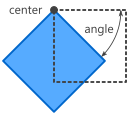
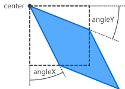
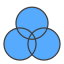
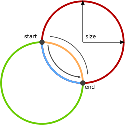
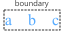

# PiWeb Custom Plot


- [Quickstart](#quickstart)
- [Package Definition](#package-definition)
    - [Localization](#localization)
    - [Dictionaries](#dictionaries)
    - [Enumerations](#enumerations)
    - [Package Format](#package-format)       
- [PiWeb Interface](#piweb-interface)
    - [Basic Functions](#basic-functions)
    - [Environment](#environment)
    - [Properties](#properties)
- [Localization](#localization-1)
    - [Enumerations](#enumerations-1)      
    - [Classes](#classes)      
    - [Methods](#methods)
- [Drawing](#drawing)
    - [Interfaces](#interfaces)
    - [Common](#common)       
    - [Drawing](#drawing-1)       
    - [Transform](#transform)        
    - [Geometry](#geometry)        
    - [Pens and Brushes](#pens-and-brushes)       
    - [Text](#text)       
- [Data Provider](#data-provider)
    - [Common](#common-1)       
    - [Configuration](#configuration)        
    - [Catalogs](#catalogs)       
    - [Inspection Plan](#inspection-plan-interface)        
    - [Measurements](#measurements)      
    - [Raw Data](#raw-data)      
    - [System Variables](#system-variables)
- [Tooltips](#tooltips)
    - [Introduction](#introduction)
    - [Classes](#classes-1)        
- [Logging](#logging)
    - [Methods](#methods-1)

<!-- /TOC -->

<a id="markdown-quickstart" name="quickstart"></a>
## Quickstart

In order to create your first own custom plot, you should be familiar with __JavaScript__ and __Json__. As javascript is untyped, we suggest you to develop your extension using __Typescript__.  

PiWeb searches for extensions in several locations. Ordered by their priority, these are:

  * The `Extensions` folder in the PiWeb installation directory
  * In the program data directory `%PROGRAMDATA%\Zeiss\PiWeb\Extensions`
  * In the common application data directory `%APPDATA%\Zeiss\PiWeb\Extensions`  

In case the `Extensions` folder doesn't exist, you must create it first. Now create your own project folder in the extensions folder and name it `MyExtension`.
Now, create the following files and folders in your project folder:


**piweb.d.ts:** Contains the type definitions of the PiWeb custom plot interface. It will enable productivity features like syntax highlighting and auto completion in your IDE. You can find this file **TODO**.

**tsconfic.json:** Contains necessary information for the typescript compiler, like input and output directories and compiler switches. Just copy the code below and you'll be fine.

```json
{
    "compilerOptions": {
    "target": "es6",
    "strictNullChecks": true,
    "module": "commonjs",
    "sourceMap": false,
    "moduleResolution": "node",
    "noImplicitAny": true,
    "outDir" : "lib",       
    "rootDir" : "src",
    "typeRoots": ["./@types"]
    }
}
```

**package.json:** Defines static parameters of your extension, such as its name, a description, the appearance of its entry in the PiWeb toolbox and the properties that are adjustable by the user. A complete reference of the options can be found in the chapter '[Package Definition](#package-definition)'. For now, use the minimum setup shown below.

```json
{
    "name": "myextension",
    "version": "0.2.0",
    "main": "lib",
    "engines": {
        "piweb": "0.2.x"
    },
    "piweb_actions": {
        "load": "compile_typescript"
    },
    "piweb_extension": {
        "type": "plot",		
        "display": "MyExtension"		
    }
}
```

**index.ts:** This is where your extension is actually rendered. In the example below, we use the drawing API to render an orange rectangle that fills the whole area of the plot. A complete reference of the drawing functions can be found in the chapter [`DrawingContext`](#drawingcontext).

```TypeScript
import * as piweb from 'piweb'
import * as host from 'piweb_host'
import drawing = piweb.drawing;

host.on("render", renderPlot);

function renderPlot(drawingContext: drawing.DrawingContext) {
  const size = host.getSize();
  drawingContext.setBrush( drawing.Brushes.OrangeRed);
  drawingContext.drawRectangle(0, 0, size.width, size.height);
}
```

When we save all files and start the PiWeb Designer, we should find our extension in the **General** section of the toolbox:


<a id="markdown-package-definition" name="package-definition"></a>
## Package Definition


In [chapter 1](#quickstart) we already created a very simple package definition in the file **package.json**. Although it's sufficient to get us started, there are a lot more settings to be discovered.

<a id="markdown-localization" name="localization"></a>
### Localization

Every text that appears in the user interface of PiWeb can be localized. Simply replace the plain text with a localization dictionary:

```json
{    
    "piweb_extension": {        
        "display": "MyExtension"        
    }
}
```

```json
{
    "piweb_extension": {        
        "display": {
            "" : "My invariant Extension",
            "en-US": "My Extension",
            "de-DE": "Meine Erweiterung"
        }   
    }
}
```

As you can see, the localized version contains an entry for the invariant culture, which is also used as a fallback value in case the required culture is not translated. Later in this chapter, all localizable properties are marked as `localizable string` properties.

<a id="markdown-dictionaries" name="dictionaries"></a>
### Dictionaries

Some properties are marked as `dictionary`, which means they are accepting an object with custom keys and a defined value. In the example below, the `items` property accepts a dictionary, and `myFirstItem` as well as `mySecondItem` are user defined entries in this dictionary.

```json
{
    "items": {        
        "myFirstItem": {
            "name" : "My first item",
            "value" : "red"
        }, 
        "mySecondItem": {
            "name" : "My second item",
            "value" : "green"
        },    
    }
}
```

<a id="markdown-enumerations" name="enumerations"></a>
### Enumerations

The `enumeration` datatype indicates that only certain **strings** are accepted. The set of accepted strings is listed in the description of the property.

<a id="markdown-package-format" name="package-format"></a>
### Package Format

<a id="markdown-structure" name="structure"></a>
#### Structure

- [**name `string`**](#package-structure-name)
- [**version `string`**](#package-structure-version)
- [**main `string`**](#package-structure-main)
- [**engines `object`**](#package-structure-engines)
    - [**piweb `string`**](#package-structure-engines-piweb)
- [**piweb_actions `object`**](#piweb-actions)
    - [**load `string`**](#package-structure-actions-load)
- [**piweb_extension `object`**](#piweb-extensions)
    - [**type `enumeration`**](#package-structure-extensions-type)
    - [**display `localizable string`**](#package-structure-extensions-display)
    - [**description `localizable string`**](#package-structure-extensions-description)
    - [**icon `string`**](#package-structure-extensions-icon)
    - [**toolbox `object`**](#package-structure-extensions-toolbox)
        - [**categories `dictionary`**](#package-structure-extensions-toolbox-categories)
            - [**name `localizable string`**](#package-structure-extensions-toolbox-categories-name)
            - [**priority `number`**](#package-structure-extensions-toolbox-categories-priority)
        - [**items `dictionary`**](#package-structure-extensions-toolbox-items)
            - [**name `localizable string`**](#package-structure-extensions-toolbox-items-name)
            - [**description `localizable string`**](#package-structure-extensions-toolbox-items-description)
            - [**icon `string`**](#package-structure-extensions-toolbox-items-icon)
            - [**category `string`**](#package-structure-extensions-toolbox-items-category)
            - [**element_size `object`**](#package-structure-extensions-toolbox-items-element_size)
                - [**width `number`**](#package-structure-extensions-toolbox-items-element_size-width)
                - [**height `number`**](#package-structure-extensions-toolbox-items-element_size-height)
    - [**propertygrid `object`**](#package-structure-extensions-propertygrid)
        - [**categories `dictionary`**](#package-structure-extensions-propertygrid-categories)
            - [**name `localizable string`**](#package-structure-extensions-propertygrid-categories-name)
            - [**priority `number`**](#package-structure-extensions-propertygrid-categories-priority)
        - [**entries `dictionary`**](#package-structure-extensions-propertygrid-entries)
            - [**name `localizable string`**](#package-structure-extensions-propertygrid-entries-name)
            - [**description `localizable string`**](#package-structure-extensions-propertygrid-entries-description)
            - [**type `enumeration`**](#package-structure-extensions-propertygrid-entries-type)
            - [**category `string`**](#package-structure-extensions-propertygrid-entries-category)
            - [**default_value `any`**](#package-structure-extensions-propertygrid-entries-default_value)
            - [**options `dictionary`**](#package-structure-extensions-propertygrid-entries-options)
                - [**name `localizable string`**](#package-structure-extensions-propertygrid-entries-options-name)
                - [**description `localizable string`**](#package-structure-extensions-propertygrid-entries-options-description)

<a id="markdown-top-level-properties" name="top-level-properties"></a>
#### Top Level Properties

<a id="package-structure-name" name="package-structure-name"></a>
**name `string`**

Custom string that is used to identify the package internally. Must be composed from lower case characters, digits and a set of special characters:
`'$', '-', '_', '.', '+', '!', '*', '\'', '(', ')', ','`. It must have a length between 1 and 214 characters and may not start with a dot (`.`) or an underscore (`_`).

<a id="package-structure-version" name="package-structure-version"></a>
**version `string`**

A valid semantic version string containing three numbers, separated by dots. For more information about semantic versioning, visit the [project website](http://semver.org/).

<a id="package-structure-main" name="package-structure-main"></a>
**main `string`**

Path to folder that contains the `index.js` file. In case you used typescript, it is the value of the property `outDir` in the `tsconfig.json` file.

<a id="package-structure-engines" name="package-structure-engines"></a>
**engines `object`**

Defines the supported engine versions of this plot. Please read the [engines](#engines) chapter for further information.

**piweb_actions `object`**

Defines additional actions. Please read the [actions chapter](#piweb-actions)  for further information.

**piweb_extension `object`**

Defines the content of the extension. Please read the [extensions chapter](#piweb-extensions) for further information.

<a id="markdown-engines" name="engines"></a>
#### Engines
<a id="package-structure-engines-piweb" name="package-structure-engines-piweb"></a>
**piweb `string`**

A valid semantic version string containing three numbers, separated by dots. It identifies the toolset that PiWeb will use to execute the extension. For more information about semantic versioning, visit the [project website](http://semver.org/).

<a id="markdown-piweb-actions" name="piweb-actions"></a>
#### PiWeb Actions

<a id="package-structure-actions-load" name="package-structure-actions-load"></a>
**load `string`**

A string describing actions, that will be executed when the package loads. Currently, the only recognized value is `compile_typescript`, which will trigger the typescript compiler.

<a id="markdown-piweb-extensions" name="piweb-extensions"></a>
#### PiWeb Extensions

<a id="package-structure-extensions-type" name="package-structure-extensions-type"></a>
**type `enumeration`**

Identifies the extension type. Currently, the only accepted value is `plot`, which identifies a PiWeb plot extension.

<a id="package-structure-extensions-display" name="package-structure-extensions-display"></a>
**display `localizable string`**

Sets the display name of the item in the PiWeb Designer toolbox.

<a id="package-structure-extensions-description" name="package-structure-extensions-description"></a>
**description `localizable string`**

Sets the description of the item in the PiWeb Designer toolbox, which is visible when the user hovers over the entry.

<a id="package-structure-extensions-icon" name="package-structure-extensions-icon"></a>
**icon `string`**

Path to the icon, relative to the `package.json` file. Usually, you simply specify the filename, and place the icon next to your `package.json` file. The icon is used on several places in PiWeb Designer, such as the toolbox, the page structure and the element properties tab. PiWeb can handle the following file formats: `bmp`, `gif`, `ico`, `jpg`, `png`, `tiff`, `wmp`.

> PiWeb will scale the image to a size of 16\*16 and 32\*32 pixels. To achieve the best result, use an `ico` file that contains bitmaps of both sizes.

<a id="package-structure-extensions-toolbox" name="package-structure-extensions-toolbox"></a>
**toolbox `object`**   

If you want multiple toolbox entries to be generated by your plot (e.g. because your extension provides a full infrastructure of elements), you can define them here. Please read the chapter '[toolbox properties](#toolbox-properties)' for further information.

<a id="package-structure-extensions-propertygrid" name="package-structure-extensions-propertygrid"></a>
**propertygrid `object`**

Determines the properties of the plot that can be adjusted by the user in PiWeb Designer. Please read the chapter '[propertygrid properties](#propertygrid-properties)' for further information.

<a id="markdown-toolbox-properties" name="toolbox-properties"></a>
#### Toolbox Properties

<a id="package-structure-extensions-toolbox-categories" name="package-structure-extensions-toolbox-categories"></a>
**categories `dictionary`**

Describes additional categories for the element toolbox in PiWeb Designer. Please read the chapter '[toolbox categories](#toolbox-categories)' for further information.

<a id="package-structure-extensions-toolbox-items" name="package-structure-extensions-toolbox-items"></a>
**items `dictionary`**

Describes the entries for the element toolbox in PiWeb Designer. Please read the chapter '[toolbox items](#toolbox-items)' for further information.

<a id="markdown-toolbox-categories" name="toolbox-categories"></a>
##### Toolbox Categories

<a id="package-structure-extensions-toolbox-categories-name" name="package-structure-extensions-toolbox-categories-name"></a>
**name `localizable string`**

The name of the category that is displayed on top of it in the PiWeb Designer.

<a id="package-structure-extensions-toolbox-categories-priority" name="package-structure-extensions-toolbox-categories-priority"></a>
**priority `number`**

The priority determines where the category is placed relative to the existing categories. 

<a id="markdown-toolbox-items" name="toolbox-items"></a>
##### Toolbox Items

<a id="package-structure-extensions-toolbox-items-name" name="package-structure-extensions-toolbox-items-name"></a>
**name `localizable string`**

Sets the display name of the item in the PiWeb Designer toolbox.

<a id="package-structure-extensions-toolbox-items-description" name="package-structure-extensions-toolbox-items-description"></a>
**description `localizable string`**

Sets the description of the item in the PiWeb Designer toolbox, which is visible when the user hovers over the entry.

<a id="package-structure-extensions-toolbox-items-icon" name="package-structure-extensions-toolbox-items-icon"></a>
**icon `string`**

Sets the icon of the item in the PiWeb Designer toolbox. Please read the chapter [icon](#package-structure-extensions-icon) for further information.

<a id="package-structure-extensions-toolbox-items-category" name="package-structure-extensions-toolbox-items-category"></a>
**category `string`**

Sets the category under which the item appears in the PiWeb Designer toolbox. The value must appear as dictionary key in the [`categories`](#package-structure-extensions-toolbox-categories) dictionary or be equal to one of the built in category keys of PiWeb:

| Key                          | English Name        | German Name              |
|------------------------------|---------------------|--------------------------|
|**`Audit`**	               |Audit calculations   | Auditberechnungen        |
|**`AutoShapes`**	           |Autoshapes	         | Autoformen               |
|**`Container`**	           |Container	         | Container                |
|**`CustomPlots`** 	           |Extensions	         | Erweiterungen            |
|**`Formplots`**	           |Form plots	         | Formplots                |
|**`General`**	               |General              | Allgemein                |
|**`Images`**	               |Images	             | Bilder                   |
|**`InteractiveElements`**     |Interactive elements | Interaktive Elemente     |
|**`Statistics`**	           |Statistics	         | Statistik                |
|**`TablesAndDirectories`**    |Tables & Directories | Tabellen & Verzeichnisse |
|**`Templates`**	           |Templates 	         |  Vorlagen                |


<a id="package-structure-extensions-toolbox-items-element_size" name="package-structure-extensions-toolbox-items-element_size"></a>
**element_size `object`**

Describes the initial size of the element when created on the report. Please read the chapter [element size](#element-size) for further information.

<a id="markdown-element-size" name="element-size"></a>
###### Element Size         

<a id="package-structure-extensions-toolbox-items-element_size-width" name="package-structure-extensions-toolbox-items-element_size-width"></a>
**width `number`**

The initial element width on the report in **millimeters**.

<a id="package-structure-extensions-toolbox-items-element_size-height" name="package-structure-extensions-toolbox-items-element_size-height"></a>
**height `number`**               

The initial element height on the report in **millimeters**.

<a id="markdown-propertygrid-properties" name="propertygrid-properties"></a>
#### Propertygrid Properties

<a id="package-structure-extensions-propertygrid-categories" name="package-structure-extensions-propertygrid-categories"></a>
**categories `dictionary`**

Describes the categories of the PiWeb Designer that are used by the custom plot. Please read the chapter '[propertygrid categories](#propertygrid-categories)' for further information.

<a id="package-structure-extensions-propertygrid-entries" name="package-structure-extensions-propertygrid-entries"></a>
**entries `dictionary`**

Describes the additional property grid entries of the plot. The defined property grid entries are added to a set of default properties that every element has. Please read the chapter '[propertygrid entries](#propertygrid-entries)' for further information.

<a id="markdown-propertygrid-categories" name="propertygrid-categories"></a>
##### Propertygrid Categories

<a id="package-structure-extensions-propertygrid-categories-name" name="package-structure-extensions-propertygrid-categories-name"></a>
**name `localizable string`**

The name of the category that is displayed in the PiWeb Designer property grid.

<a id="package-structure-extensions-propertygrid-categories-priority" name="package-structure-extensions-propertygrid-categories-priority"></a>
**priority `number`**

The priority determines where the category is placed relative to the other categories. 

<a id="markdown-propertygrid-entries" name="propertygrid-entries"></a>
##### Propertygrid Entries

<a id="package-structure-extensions-propertygrid-entries-name" name="package-structure-extensions-propertygrid-entries-name"></a>
**name `localizable string`**

The name that will be displayed in the property tab of PiWeb Designer

<a id="package-structure-extensions-propertygrid-entries-description" name="package-structure-extensions-propertygrid-entries-description"></a>
**description `localizable string`**

The info text that will be displayed when hovering the property with the mouse.

<a id="package-structure-extensions-propertygrid-entries-category" name="package-structure-extensions-propertygrid-entries-category"></a>
**category `string`**

The key of the entry in the [`categories`](#package-structure-extensions-propertygrid-categories) dictionary to which this property is associated. In case you want to use existing categories, like `General`, `Appearance` or `Layout`, you have to use the following keys: 

| Key                   |English name (en-US)           | German name (de-DE) | 
|-----------------------|-------------------------------|---------------------|
| **`General`**           | General                       | Allgemein           |
| **`Axis`**              | Axis                          | Achsen              | 
| **`Appearance`**        | Appearance                    | Darstellung         | 
| **`Layout`**            | Layout                        | Layout              |
| **`GaugeIntegration`**  | Measuring device integration  | Messmittelanbindung |
| **`Misc`**              | Misc                          | Sonstiges           |


<a id="package-structure-extensions-propertygrid-entries-type" name="package-structure-extensions-propertygrid-entries-type"></a>
**type `enumeration`**

The datatype that determines which kind of editor is shown for the property

| Type          | Description           | Editor                   |
|---------------|-----------------------|--------------------------|
| **`string`**  | Unicode text          |          |
| **`integer`** | Integral number       |    |
| **`double`**  | Floating point number |    |
| **`boolean`** | Yes/No value          |            |
| **`enum`**    | Selection of an option|            |
| **`color`**   | Color with opacity    |            |
| **`brush`**   | Color or gradient with opacity  |            |
| **`pen`**     | Pen with color, thickness, dashstyle and opacity  |           |
| **`font`**    | Font with family, color, size and style, as well as textdecorations      |               |

<a id="package-structure-extensions-propertygrid-entries-default_value" name="package-structure-extensions-propertygrid-entries-default_value"></a>
**default_value `any`**

Each datatype accepts a different default value:

**`string`**
```json
"default_value": "value"
```

Any unicode string is accepted

**`integer`**
```json
"default_value": 1
```

Integral numbers are accepted

**`double`**
```json
"default_value": 1.0
```

Floating point or integral numbers are accepted

**`boolean`**
```json
"default_value": true | false
```

`true` and `false` are accepted

**`enum`**
```json
"default_value": "value"
```

The keys of the [`options`](#package-structure-extensions-propertygrid-entries-options) property are accepted.

**`color`**
```json
"default_value": "#ff0000"
```

Strings in the form of `#rrggbb`

**`brush`**

```json
"default_value": {
    "type": "solid" | "lineargradient" | "radialgradient",
    "color": "#ff0000", 
    "color2": "#0000ff", // only gradient brushes
    "opacity" 1.0,       // [0..1] where 1 is opaque
    "angle": 0,          // Only for linear gradient
    "center": {          // Only for radial gradient
        "x" : 0.5,       // [0..1] 0 = left, 1 = right
        "y" : 0.5        // [0..1] 0 = top, 1 = bottom
    }
}
```

Accepts an object of the specified structure. Some properties are only used for special brush types.

**`pen`**
```json
"default_value": {
    "color": "#ff0000",
    "thickness" 0.3     // Millimeters
}
```

Only pens with solid color and thickness are accepted.

**`font`**
```json
"default_value": {
    "color": "#ff0000",
    "family": "Arial",
    "size": 10,
    "bold": false,
    "italic": false,
    "underline": false,
    "strikethrough": false,
}
```

Accepts a font description object with the properties shown above.

<a id="package-structure-extensions-propertygrid-entries-options" name="package-structure-extensions-propertygrid-entries-options"></a>
**options `dictionary`**

Determines the possible values of a property with type `enum`. The plot will get the key of the selected entry as value for the property. Please read the chapter '[option properties](#option-properties)' for further information.

<a id="markdown-option-properties" name="option-properties"></a>
###### Option Properties

<a id="package-structure-extensions-propertygrid-entries-options-name" name="package-structure-extensions-propertygrid-entries-options-name"></a>
**name `localizable string`**

The name that is displayed in the dropdown.

<a id="package-structure-extensions-propertygrid-entries-options-description" name="package-structure-extensions-propertygrid-entries-options-description"></a>
**description `localizable string`**

The description that is displayed when hovering an option in the dropdown with the mouse

<a id="markdown-piweb-interface" name="piweb-interface"></a>
## PiWeb Interface

You can retrieve information about the element, its properties and settings by using the `host` interface. To access it, include the PiWeb host module in your script.

```TypeScript
import * as host from 'piweb_host'
```

<a id="markdown-basic-functions" name="basic-functions"></a>
### Basic Functions 

**getSize `Size`**

```TypeScript
function getSize(): Size;
```

Returns the current size of the element in **millimeters**. 

**getPosition `Point`**

```TypeScript
function getPosition(): Point;
```

Returns the position of the element on the report page in **millimeters**.

<a id="markdown-environment" name="environment"></a>
### Environment

The `environment` interface is accessible via the `piweb` interface and exposes the following members

**isDesignMode `boolean`**

```TypeScript
const isDesignMode : boolean = piweb.environment.isDesignMode;
```

If `true`, the plot is rendered by the PiWeb Designer, otherwise it's rendered by the PiWeb Monitor. Some very complex elements don't render their complete content while in design mode, to guarantee a smooth and fluent editing in PiWeb Designer.

**toolboxItemName `string`**

```TypeScript
const toolboxItemName : string = piweb.environment.toolboxItemName;
```

In case you specified multiple toolbox items in the `package.json` file, this is the interface to find out, which item the user picked. The returned value is equal to the property name you used to identity the toolbox entry.

**currentCulture `CultureInfo`**

```TypeScript
const currentCulture : CultureInfo = piweb.environment.currentCulture;
```

Returns the culture in which the host process has been started. You can use this information to

<a id="markdown-properties" name="properties"></a>
### Properties

The properties you define in the `package.json` file can be accessed via the `piweb.properties` interface. To enable type checking, there is one function for each available datatype.

**getStringProperty `string`**

```TypeScript
function getStringProperty(id : string) : string
```

Returns the value of the property with the name `id` as a string.

**getIntegerProperty `number`**

```TypeScript
function getIntegerProperty(id : string) : number
```

Returns the value of the property with the name `id` as a number.

**getDoubleProperty `number`**

```TypeScript
function getDoubleProperty(id : string) : number
```
 
Returns the value of the property with the name `id` as a number. 

**getBooleanProperty `boolean`**

```TypeScript
function getBooleanProperty(id : string) : boolean
```
 
Returns the value of the property with the name `id` as a boolean. 

**getEnumProperty `string`**

```TypeScript
function getEnumProperty(id : string) : string
```
 
Returns the key of the selected option of the property with the name `id` as a string. Please read the chapter '[propertygrid options](#package-structure-extensions-propertygrid-entries-options)' for further information.

**getColorProperty `ColorDescription`**

```TypeScript
function getColorProperty(id : string) : ColorDescription
```
 
Returns the value of the property with the name `id` as a `ColorDescription`. The result can be used as parameter for the `create` method of the [`Color`](#color) class.

**getBrushProperty `BrushDescription`**

```TypeScript
function getBrushProperty(id : string) : BrushDescription
```
 
Returns the value of the property with the name `id` as a `BrushDescription`. The result can be used as parameter for the `create` method of the [`Brush`](#brush) class.

**getPenProperty `PenDescription`**

```TypeScript
function getPenProperty(id : string) : PenDescription
```
 
Returns the value of the property with the name `id` as a `PenDescription`. The result can be used as parameter for the `create` method of the [`Pen`](#pen) class.

**getFontProperty `FontDescription`**

```TypeScript
function getFontProperty(id : string) : FontDescription
```
 
Returns the value of the property with the name `id` as a `FontDescription`. The result can be used as parameter for the `create` method of the [`Font`](#font) class.

<a id="markdown-localization-1" name="localization-1"></a>
## Localization

<a id="markdown-enumerations-1" name="enumerations-1"></a>
### Enumerations

<a id="markdown-datekind" name="datekind"></a>
#### DateKind

```TypeScript
enum DateKind
```

**`AssumeLocal`**

TODO
        
**`AssumeUTC`**

TODO

<a id="markdown-classes" name="classes"></a>
### Classes

<a id="markdown-cultureinfo" name="cultureinfo"></a>
#### CultureInfo

```TypeScript
class CultureInfo
```

Contains the identifiers of a specific culture. PiWeb can use these information to provide localization and correct formatting of numbers and dates.

**twoLetterISOLanguageName: `string`**

The ISO 639-1 two-letter code for the language of the culture.

**threeLetterISOLanguageName: `string`**

The ISO 639-2 three-letter code for the language of the culture.

**name: `string`**

The name of the culture in the format `languagecode2-country/regioncode2`.

<a id="markdown-regioninfo" name="regioninfo"></a>
#### RegionInfo

```TypeScript
class RegionInfo
```

Contains the ifentifiers of a specific country or region. 

**twoLetterISORegionName: `string`**

The two-letter code defined in ISO 3166 for the country/region.

**threeLetterISORegionName: `string`**

The three-letter code defined in ISO 3166 for the country/region.

**name: `string`**

The name or ISO 3166 two-letter country/region code.


<a id="markdown-methods" name="methods"></a>
### Methods

**formatNumber `string`**

```TypeScript
function formatNumber(
    value: number, 
    formatString?: string | null, 
    culture?: CultureInfo | null
) : string;
```

Converts the specified value to its string representation using the specified format string and the culture specific format information.

**parseNumber `number | null`**

```TypeScript
function parseNumber(
    str: string, 
    culture?: CultureInfo | null
): number | null;
```

Converts the specified string representation of a number in a specified culture specific format to its `number` equivalent.

**formatDate `string`**

```TypeScript
function formatDate(
    date: Date, 
    offset?: number | null, 
    format?: string | null, 
    culture?: CultureInfo | null
): string;
```

Converts the specified date to its string representation using the specified format string and the culture specific format information.

**parseDate `Date | null`**

```TypeScript
function parseDate(
    str: String, 
    culture?: CultureInfo | null, 
    dateKind?: DateKind | null
) : Date | null;
```

Converts the specified string to its `Date` equivalent by using culture specific format information and formatting style.

**parseDateExact `Date | null`**

```TypeScript
function parseDateExact(
    str: String, 
    format: string, 
    culture?: CultureInfo | null, 
    dateKind?: DateKind | null
) : Date | null;
```

Converts the specified string to its `Date` equivalent by using culture specific format information and formatting style.

**TODO:** Link to microsoft format string reference... or a short reference

<a id="markdown-drawing" name="drawing"></a>
## Drawing  
 
To access the drawing classes, import the `piweb` interface into your script. All necessary classes for drawing are encapsulated in the `piweb.drawing` module. The custom plot will be rendered whenever something changes, e.g. a property value, its size or position. When this happens, the custom plot api will emit the `render` event, which has a [`DrawingContext`](#drawingcontext) object as its parameter.

```TypeScript
import * as piweb from 'piweb'
import * as host from 'piweb_host'

host.on("render", render);

function render(context: piweb.drawing.DrawingContext) {
    ...
}
```
 
Be aware that all coordinates and values are interpreted as **millimeters**. PiWeb draws with a resolution of **96 DPI**, so one millimeter is equal to `96 / 25.4 ~ 3.58` pixels, or one pixel is equal to `25.4 / 96 ~ 0.2646` millimeters. PiWeb will take care, that everything you draw is aligned to display coordinates, so nothing will look blurry.
"
<a id="markdown-interfaces" name="interfaces"></a>
### Interfaces

Most drawing objects, like [`Color`](#color), [`Brush`](#brush), [`Pen`](#pen), [`Font`](#font) and [`Geometry`](#geometry) implement an interface that is named like the implementing class, with an additional `Description` suffix (e.g. `ColorDescription`).
Classes that implement such a description interface have a `create` method, that takes a description interface as parameter.<br><br> Constructors in javascript and typescript cannot be overloaded, which means that you have to specifiy a value for every parameter. The advantage of interfaces in typescript is that they can be represented by anonymous objects with nullable properties. This leads to shorter and better readable code:

**Long version using constructors:**

```TypeScript 
context.setPen(new piweb.drawing.Pen(
    new piweb.drawing.SolidColorBrush(
        new piweb.drawing.Color(255, 0, 0, 255),
        1.0), 
    1.0, 				
    "flat", 			
    "flat", 			
    "bevel", 			
    new Array<number>(),
    0.0,			
    "flat"
));

context.drawLine(
    new piweb.drawing.Point(0.0, 0.0), // from
    new piweb.drawing.Point(1.0, 1.0)  // to
);
``` 

**Short version using interfaces:**

```TypeScript 
context.setPen({
    brush: { 
        type: "solid", 
        color: { r: 255, g: 0, b: 0 } 
    },
    thickness: 1.0}
);

context.drawLine(
    { x: 0.0, y: 0.0 }, 
    { x: 1.0, y: 1.0 }
);
```

As you might have noticed, you don't have to specify all parameters when using the interface version. For almost every value, there is a defined **default value** which is used in case the actual value is not specified. The API reference in the following chapters will not always list all possible parameter types. You'll notice that most types and functions can be configured in several more comfortable ways, as most functions are defined to take interfaces as their parameters.

<a id="markdown-common" name="common"></a>
### Common

<a id="markdown-content" name="content"></a>
#### Content

- [Point](#point)
- [Size](#size)

<a id="markdown-point" name="point"></a>
#### Point

```TypeScript
class Point()
```

Represents a position

**x `number`**

Hoirizontal position.

**y `number`**

Vertical position

<a id="markdown-size" name="size"></a>
#### Size

```TypeScript
class Size()
```

Represents a position

**width `number`**

Hoirizontal dimension.

**height `number`**

Vertical dimention.

<a id="markdown-drawing-1" name="drawing-1"></a>
### Drawing

<a id="markdown-content-1" name="content-1"></a>
#### Content

- [Drawing](#drawing-2)
- [DrawingContext](#drawingcontext)

<a id="markdown-drawing-2" name="drawing-2"></a>
#### Drawing

```TypeScript
class Drawing
```

Describes a two dimensional vector graphics image.

**open `DrawingContext`**

```TypeScript
function open() : DrawingContext
```

Creates a [`DrawingContext`](#drawingcontext) which can be used to create the content of the drawing.

<a id="markdown-drawingcontext" name="drawingcontext"></a>
#### DrawingContext

```TypeScript
class DrawingContext
```

Describes the content of a drawing with the help of various drawing commands.

<a id="drawingcontext-drawline" name="drawingcontext-drawline"></a>
**drawLine `void`**

```TypeScript
function drawLine(
    start: Point, 
    end: Point
): void;
```
Draws a line using from `start` to `end` using the pen which has been previously set with the [`setPen`](#drawingcontext-setpen) function. In case you want to draw a larger number of lines, consider using the [`drawLines`](#drawingcontext-drawlines) or [`drawGeometry`](#drawingcontext-drawgeometry) function to improve the drawing performance.

<a id="drawingcontext-drawlines" name="drawingcontext-drawlines"></a>
**drawLines `void`**

```TypeScript
function drawLines(
    lines: Point[]
): void;
```
Draws multiple lines that are **not** connected using the pen which has been previously set with the [`setPen`](#drawingcontext-setpen) function. The number of points provided as parameter `lines` must be even. Each two points describe a line. In case you want to draw connected points, please consider using the function [`drawGeometry`](#drawingcontext-drawgeometry) instead of using the [`drawLines`](#drawingcontext-drawlines) function with duplicate points.

<a id="drawingcontext-drawrectangle" name="drawingcontext-drawrectangle"></a>
**drawRectangle `void`**

```TypeScript
function drawRectangle(
    x: number, 
    y: number, 
    w: number, 
    h: number
): void;
```
Draws a rectangle with of width `w` and height `h` at Point `x;y` and fills it with the brush which has been previously set using the [`setBrush`](#drawingcontext-setbrush) function, and strokes it using the pen which has been previously set with the [`setPen`](#drawingcontext-setpen) function. In case you want to draw a larger number of rectangles, consider using the [`drawGeometry`](#drawingcontext-drawgeometry) function with a [`GeometryGroup`](#geometrygroup), containing multiple [`RectangleGeometry`](#rectanglegeometry) objects to improve the drawing performance.

<a id="drawingcontext-drawellipse" name="drawingcontext-drawellipse"></a>
**drawEllipse `void`**

```TypeScript
function drawEllipse(
    center: Point, 
    radiusX: number, 
    radiusY: number
): void;
```
Draws an ellipse around the point `center` and fills it with the brush which has been previously set using the [`setBrush`](#drawingcontext-setbrush) function, and strokes it using the pen which has been previously set with the [`setPen`](#drawingcontext-setpen) function. In case you want to draw a larger number of ellipses (e.g. points), consider using the [`drawGeometry`](#drawingcontext-drawgeometry) function with a 
[`GeometryGroup`](#geometrygroup), containing multiple [`EllipseGeometry`](#ellipsegeometry) objects to improve the drawing performance.

<a id="drawingcontext-drawgeometry" name="drawingcontext-drawgeometry"></a>
**drawGeometry `void`**

```TypeScript
function drawGeometry(
    geometry: Geometry
): void;
```
Draws the specified [`Geometry`](#geometry) and fills it with the brush which has been previously set using the [`setBrush`](#drawingcontext-setbrush) function, and strokes it using the pen which has been previously set with the [`setPen`](#drawingcontext-setpen) function. In case you want to draw a larger number of geometries, consider greating a [`GeometryGroup`](#geometrygroup), containing multiple [`Geometry`](#geometry) objects to improve the drawing performance.

<a id="drawingcontext-drawtext" name="drawingcontext-drawtext"></a>
**drawText `void`**

```TypeScript
function drawText(
    text: FormattedText, 
    settings: TextDrawingSettings
): void;
```
Draws the specified [`FormattedText`](#formattedtext) at with the specified [`TextDrawingSettings`](#textdrawingsettings). There are numerous properties which will help you to adjust how the text is layouted and displayed. For more information, please read the chapter [FormattedText](#formattedtext), [Font](#font) and [TextDrawingSettings](#textdrawingsettings).

<a id="drawingcontext-drawimage" name="drawingcontext-drawimage"></a>
**drawImage `void`**

```TypeScript
function drawImage(
    data: Buffer, 
    rectangle: Rect
): void;
```

Draws the specified image buffer into the specifield `rectangle`. In case the image size differs from the rectangle, the image will be stretched.

<a id="drawingcontext-drawdrawing" name="drawingcontext-drawdrawing"></a>
**drawDrawing `void`**

```TypeScript
function drawDrawing(
    drawing: Drawing
): void;
```

Draws the specified [`Drawing`](#drawing) into the current drawing context. To set the position and size of the drawing, use the [`pushTransform`](#drawingcontext-pushtransform) function.

<a id="drawingcontext-setpen" name="drawingcontext-setpen"></a>
**setPen `void`**
```TypeScript
function setPen(
    pen: Pen | null
): void;
```

Sets the pen that will be used for all subsequent calls to [`drawLine`](#drawingcontext-drawline), [`drawLines`](#drawingcontext-drawlines), [`drawRectangle`](#drawingcontext-drawrectangle), [`drawEllipse`](#drawingcontext-drawellipse) and [`drawGeometry`](#drawingcontext-drawgeometry). In case you don't want your rectangle, ellipse or geometry to be stroked, pass `null` as parameter into the function.

<a id="drawingcontext-setbrush" name="drawingcontext-setbrush"></a>
**setBrush  `void`**

```TypeScript
function setBrush(
    brush: Brush | null
): void;
```

Sets the brush that will be used for all subsequent calls to [`drawRectangle`](#drawingcontext-drawrectangle), [`drawEllipse`](#drawingcontext-drawellipse) and [`drawGeometry`](#drawingcontext-drawgeometry). In case you don't want your rectangle, ellipse or geometry to be filled, pass `null` as parameter into the function.

<a id="drawingcontext-pushtransform" name="drawingcontext-pushtransform"></a>
**pushTransform `void`**

```TypeScript
function pushTransform(
    transformation: Transform
): void;
```
Multiplies the current transformation matrix with another [`Transform`](#transform). To undo it, use the [`pop`](#drawingcontext-pop) function.

<a id="drawingcontext-pushclip" name="drawingcontext-pushclip"></a>
**pushClip `void`**

```TypeScript
function pushClip(
    geometry: Geometry
): void;
```

Sets a new clip geometry. All subsequent drawing calls will only be rendered inside the fill area of the specified [`geometry`](#geometry). Be aware that unfilled geometries like straight lines don't have any fill area, which means that all subsequent drawing calls have no effect. To undo it, use the [`pop`](#drawingcontext-pop) function.

<a id="drawingcontext-pushopacity" name="drawingcontext-pushopacity"></a>
**pushOpacity `void`**

```TypeScript
function pushOpacity(
    opacity: number
): void;
```

Sets the opacity of all subsequent drawing calls. When drawing transparent objects, the transparency of the object is multiplied with the specified `opacity`. To undo it, use the [`pop`](#drawingcontext-pop) function.

<a id="drawingcontext-pop" name="drawingcontext-pop"></a>
**pop `void`**

```TypeScript
function pop(): void;
```

Removes the most recent effect caused by [`pushTransform`](#drawingcontext-pushtransform), [`pushOpacity`](#drawingcontext-pushopacity) or [`pushClip`](#drawingcontext-pushclip) from the stack. This function will cause an error in case none of the specified commands has been executed before.

<a id="markdown-transform" name="transform"></a>
### Transform

<a id="markdown-content-2" name="content-2"></a>
#### Content

- [Transform](#transform-1)
- [TranslationTransform](#translationtransform)
- [RotationTransform](#rotationtransform)
- [ScalingTransform](#scalingtransform)
- [ShearTransform](#sheartransform)
- [MatrixTransform](#matrixtransform)
- [TransformGroup](#transformgroup)

<a id="markdown-transform-1" name="transform-1"></a>
#### Transform

```TypeScript
abstract class Transform
```

Describes a transformation matrix that can be used to change the position, rotation and size of geometries.

<a id="markdown-translationtransform" name="translationtransform"></a>
#### TranslationTransform

```TypeScript
class TranslationTransform extends Transform
```

Moves an object in horizontal and vertical direction.


**x `number`**

The translation in horizontal direction.

**y `number`**

The translation in vertical direction.

<a id="markdown-rotationtransform" name="rotationtransform"></a>
#### RotationTransform

```TypeScript
class RotationTransform extends Transform
```

Rotates an object around a specific point.



**angle `number`**

The angle in degrees of clockwise rotation.

**center [`Point`](#point)**

The rotation center.

<a id="markdown-scalingtransform" name="scalingtransform"></a>
#### ScalingTransform

```TypeScript
class ScalingTransform extends Transform
```

Scales an object in horizontal and vertical direction


**scaleX `number`**

The horizontal scaling factor.

**scaleY `number`**

The vertical scaling factor.

**center [`Point`](#point)**

The center from which the scaling is calculated.

<a id="markdown-sheartransform" name="sheartransform"></a>
#### ShearTransform

```TypeScript
class ShearTransform extends Transform
```

Describes a transformation that can be used to create the illusion of perspective. 



**angleX `number`**

The rotation angle of the x coordinates.

**angleY `number`**

The rotation angle of the y coordinates.

**center [`Point`](#point)** 

The rotation center.

<a id="markdown-matrixtransform" name="matrixtransform"></a>
#### MatrixTransform

```TypeScript
class MatrixTransform extends Transform
```

All transformation types are converted into a 3x3 matrix when they are applied. With the matrix transformation it's possible to define a transformation that is based on an arbitary 3x3 matrix. 

| **m11** | **m12** | **0** |
|-----|-----|---|
| **m21** | **m22** | **0** |
| **offsetX** | **offsetY** | **1** |

**m11 `number`**

M11 value of the matrix.

**m12 `number`**

M12 value of the matrix.

**m21 `number`**

M21 value of the matrix.

**m22 `number`**

M22 value of the matrix.

**offsetX `number`**

M31 value of the matrix.

**offsetY `number`**

M32 value of the matrix.


<a id="markdown-transformgroup" name="transformgroup"></a>
#### TransformGroup

```TypeScript
class TransformGroup extends Transform
```

**children [`Transform[]`](#transform)**

Combines multiple transformations into one by multiplying their matrices. As matrix multiplication is not commutative, the order of the child matrices is important.

<a id="markdown-geometry" name="geometry"></a>
### Geometry

<a id="markdown-content-3" name="content-3"></a>
#### Content

- [Geometry](#geometry-1)
- [FillRule](#fillrule)
- [GeometryCombineMode](#geometrycombinemode)
- [LineGeometry](#linegeometry)
- [RectangleGeometry](#rectanglegeometry)
- [EllipseGeometry](#ellipsegeometry)
- [PathGeometry](#pathgeometry)
    - [PathFigure](#pathfigure)
    - [PathSegment](#pathsegment)
        - [ArcSegment](#arcsegment)
        - [LineSegment](#linesegment)
        - [BezierSegment](#beziersegment)
        - [QuadraticBezierSegment](#quadraticbeziersegment)
        - [PolyLineSegment](#polylinesegment)
        - [PolyBezierSegment](#polybeziersegment)
        - [PolyQuadraticBezierSegment](#polyquadraticbeziersegment)
- [GeometryGroup](#geometrygroup)
- [CombinedGeometry](#combinedgeometry)

<a id="markdown-geometry-1" name="geometry-1"></a>
#### Geometry

```TypeScript
abstract class Geometry
```

Geometries can be used for drawing and clipping. Multiple geometries can be combined using the GroupGeometry or CombinedGeometry classes.

**transform [`Transform?`](#transform)**

All geometries can have a transformation. The default value is the identity transform.

<a id="markdown-fillrule" name="fillrule"></a>
#### FillRule

```TypeScript
enum FillRule
```

Determines how overlapping geometries are filled.

**`evenOdd` (default)**


Fills the area that is overlapped by an odd number of geometries.
<br><br><br>

**`nonZero`**



Fills the area that is overlapped by at least one geometry. 
<br><br><br>

<a id="markdown-geometrycombinemode" name="geometrycombinemode"></a>
#### GeometryCombineMode

```TypeScript
enum GeometryCombineMode
```

Determines how two geometries are combined.

**`union` (default)** 


The resulting geometry is the area that is overlapped by the first or second geometry or both.
<br><br><br>

**`intersect`**


The resulting geometry is the area that is overlapped by both geometries.
<br><br><br>

**`xor`**


The resulting geometry is the area that is overlapped by the first or second geometry, but not both.
<br><br><br>

**`exclude`**


The second geometry is subtracted from the first. 
<br><br><br>

<a id="markdown-linegeometry" name="linegeometry"></a>
#### LineGeometry

```TypeScript
class LineGeometry extends Geometry
```

Line geometries are quite simple, and are mostly used in combination with other geometries.

**start [`Point`](#point)**

The point where the line begins

**end [`Point`](#point)**

The point where the line ends

<a id="markdown-rectanglegeometry" name="rectanglegeometry"></a>
#### RectangleGeometry

```TypeScript
class RectangleGeometry extends Geometry
```

Describes a rectangle that can be stroked or filled.

**position [`Point`](#point)**

The position of the top left corner

**width `number`**

The horizontal dimension

**height `number`**

The vertical dimension

<a id="markdown-ellipsegeometry" name="ellipsegeometry"></a>
#### EllipseGeometry

```TypeScript
class EllipseGeometry extends Geometry
```

Describes a rectangle that can be stroked or filled.

**position [`Point`](#point)**

The center of the ellipse

**radiusX `number`**

The horizontal radius

**radiusY `number`**

The vertical radius

<a id="markdown-pathgeometry" name="pathgeometry"></a>
#### PathGeometry

```TypeScript
class PathGeometry extends Geometry
```

Pathgeometries are composed of one or more [PathFigure](#pathfigure) objects, which are themselves composed of [PathSegment](#pathsegment) objects. 

**fillRule [`FillRule`](#fillrule)**

Describes how overlapping geometries are filled.

**figures [`PathFigure[]`](#pathfigure)**

The collection of path figures, that compose the [`PathGeometry`](#pathgeometry). 

<a id="markdown-pathfigure" name="pathfigure"></a>
##### PathFigure

```TypeScript
class PathFigure
```

Multiple path figures compose a [`PathGeometry`](#pathgeometry). The path figures of a path geometry are **not** connected, so they appear as independent shapes.

**startPoint [`Point`](#point)**

The first Point of the path figure.

**segments [`PathSegment[]`](#pathsegment)**

The segments of the path figure. Each segment is connected to the last point of the previous segment, or to the start point in case it's the first segment in the path figure.

**isClosed `boolean`**

Determines whether the last point of the path figure should be connected to the start point. The connection is a straight line.

<a id="markdown-pathsegment" name="pathsegment"></a>
##### PathSegment

```TypeScript
abstract class PathSegment
```

Path segments define one or more points that describe a line or curve. Following path segments are supported

<a id="markdown-arcsegment" name="arcsegment"></a>
###### ArcSegment

```TypeScript
class ArcSegment extends PathSegment
```

Represents an elliptical arc between two points. To define an arc segment you have to specify two points and an ellipse. Usually, there are two possible ellipses of the same size through two points, and on these two ellipses, there are four different ellipse segments which go from the first to the second point. To define how the arc segment looks like, you have to specifiy additional parameters as shown in the following picture:




* <font color="#56abff">blue:</font> arcType `small`, sweepDirection `counterclockwise`
* <font color="#ffab56">orange:</font> arcType `small`, sweepDirection `clockwise`
* <font color="#67cc00">green:</font> arcType `large`, sweepDirection `counterclockwise`
* <font color="#b40000">red:</font> arcType `large`, sweepDirection `clockwise`

**to [`Point`](#point)**

Endpoint of the arc.

**size [`Size`](#size)**

The x- and y radius of the underlying ellipse on which the arc segment is based on. In case the ellipse is too small to span an arc between the startpoint and the endpoint, it will be scaled until it fits, preserving the aspect ratio of the ellipse.

**angle `number`**

Rotation angle of the ellipse in *degrees*.

**arcType `enumeration`**

Since there are always two different arcs with the same radius and the same sweep direction between two points, this parameter can be used to determine which one is used. Valid values are `small` and `large`.

**sweepDirection `enumeration`**

Since there are always two different arcs with the same radius and the same arc size between two points, this parameter can be used to determine which one is used. Valid values are `clockwise` and `counterclockwise`.

<a id="markdown-linesegment" name="linesegment"></a>
###### LineSegment

```TypeScript
class LineSegment extends PathSegment
```

Creates a line between two points in a [PathFigure](#pathfigure). In case you want to use multiple line segments consecutively, consider using the [PolyLineSegment](#polylinesegment).

**to [`Point`](#point)**

The endpoint of the line segment. 

<a id="markdown-beziersegment" name="beziersegment"></a>
###### BezierSegment

```TypeScript
class BezierSegment extends PathSegment
```

Describes a bezier segment, using the last point of the previous segment as start point. In case you want to use multiple bezier segments consecutively, consider using the [PolyBezierSegment](#polybeziersegment).

**control [`Point`](#point)**

First control point of the bezier curve.

**control2 [`Point`](#point)**

Second control point of the bezier curve.

**to [`Point`](#point)**

End point of the bezier curve.

<a id="markdown-quadraticbeziersegment" name="quadraticbeziersegment"></a>
###### QuadraticBezierSegment

```TypeScript
class QuadraticBezierSegment extends PathSegment
```

Describes a quadratic bezier segment, using the last point of the previous segment as start point. In case you want to use multiple quadratic bezier segments consecutively, consider using the [PolyQuadraticBezierSegment](#polyquadraticbeziersegment).

**control [`Point`](#point)**

Control point of the bezier curve.

**to [`Point`](#point)**

End point of the bezier curve.

<a id="markdown-polylinesegment" name="polylinesegment"></a>
###### PolyLineSegment

```TypeScript
class PolyLineSegment extends PathSegment
```

Describes a line strip, including the last point of the previous segment.

**points [`Point[]`](#point)**

The collection of [Point](#point) objects that defines this segment.

<a id="markdown-polybeziersegment" name="polybeziersegment"></a>
###### PolyBezierSegment

```TypeScript
class PolyBezierSegment extends PathSegment
```

Describes multiple bezier segments, including the last point of the previous segment. The number of points provided must be a multiple of three, since a single bezier segment is defined by three points.

**points [`Point[]`](#point)**

The collection of [Point](#point) objects that defines this segment.

<a id="markdown-polyquadraticbeziersegment" name="polyquadraticbeziersegment"></a>
###### PolyQuadraticBezierSegment

```TypeScript
class PolyQuadraticBezierSegment extends PathSegment
```

Describes multiple bezier segments, including the last point of the previous segment. The number of points provided must be a multiple of two, since a single quadratic bezier segment is defined by two points.

**points [`Point[]`](#point)**

The collection of [Point](#point) objects that defines this segment.

<a id="markdown-geometrygroup" name="geometrygroup"></a>
#### GeometryGroup

```TypeScript
class GeometryGroup extends Geometry
```

Describes a set of geometries that are consolidated into a group. To define how the resulting geometry is filled, use the `fillRule` parameter

**children [`Geometry[]`](#geometry)**

The geometries of which this geometry group is composed.

**fillRule [`FillRule`](#fillrule)**

Describes how overlapping geometries are filled.

<a id="markdown-combinedgeometry" name="combinedgeometry"></a>
#### CombinedGeometry

```TypeScript
class CombinedGeometry extends Geometry
```

Describes a geometry, that is composed of exactly two child geometries. The difference to the [GeometryGroup](#geometrygroup) is, that the CombinedGeometry is regarded as a single geometry with a single outline, rather than just a collection of children. To achieve this, the combination mode must be specified. CombinedGeometry objects can themselves be combined again.

**geometry1 [`Geometry`](#geometry)**

The first child.

**geometry2 [`Geometry`](#geometry)**

The second child.

**combineMode [`GeometryCombineMode`](#geometrycombinemode)**

Determines how the two geometries are combined into one single geometry.

<a id="markdown-pens-and-brushes" name="pens-and-brushes"></a>
### Pens and Brushes

<a id="markdown-content-4" name="content-4"></a>
#### Content

- [Color](#color)
- [Brush](#brush)
    - [SolidColorBrush](#solidcolorbrush)
    - [LinearGradientBrush](#lineargradientbrush)
    - [RadialGradientBrush](#radialgradientbrush)
- [Pen](#pen)
    - [LineCap](#linecap)
    - [LineJoin](#linejoin)

<a id="markdown-color" name="color"></a>
#### Color

```TypeScript
class Color
```

Describes a color with red, green, blue and alpha channel.

**r `number`**

The red channel value in the range of `[0..255]`.

**g `number`**

The green channel value in the range of `[0..255]`.

**b `number`**

The blue channel value in the range of `[0..255]`.

**a `number?`**

The alpha channel value in the range of `[0..255]`, where `0` is completely translucent and `255` is opaque.

<a id="markdown-brush" name="brush"></a>
#### Brush

```TypeScript
abstract class Brush
```

Describes how an arbitary geometry is filled.

**opacity `number`**

The opacity of the brush. Valid values are in the range of `[0..1]`, where `0` is completely translucent and `1` is opaque.

<a id="markdown-solidcolorbrush" name="solidcolorbrush"></a>
##### SolidColorBrush

```TypeScript
class SolidColorBrush extends Brush
```

Describes a brush that fills an area with a single color.

**color [`Color`](#color)**

The color of this brush.

<a id="markdown-lineargradientbrush" name="lineargradientbrush"></a>
##### LinearGradientBrush

```TypeScript
class LinearGradientBrush extends Brush
```

Describes a brush that fills an area with a linear gradient.

**color [`Color`](#color)**

The start color of the gradient.

**color2 [`Color`](#color)**

The end color of the gradient.

**rotation `number`**

The angle in degrees about which the gradient is rotated around the center.

<a id="markdown-radialgradientbrush" name="radialgradientbrush"></a>
##### RadialGradientBrush

```TypeScript
class RadialGradientBrush extends Brush
```

Describes a brush that fills an area with a radial gradient.


**color [`Color`](#color)**

The color at the center of the gradient.

**color2 [`Color`](#color)**

The color at the outer border of the gradient.

**center [`Point`](#point)**

The relative center in coordinates from `[0..1]`.

<a id="markdown-pen" name="pen"></a>
#### Pen

```TypeScript
class Pen
```

Describes the way lines are stroked.

**brush [`Brush`](#brush)**

The brush that is used to fill the outline procudes with the pen.

**thickness `number`**

The thickness of stroke procudes by the pen in **millimeters**.

**startCap [`LineCap`](#linecap)**

The geometry added to the beginning of the stroke.

**endCap [`LineCap`](#linecap)**

The geometry added to the end of the stroke.

**lineJoin [`LineJoin`](#linejoin)**

The geometry added between to segments of the stroke.

**dashStyle `number[]`**

The definition of the dashses used to render the stroke. The default value is empty, which will render one solid line. The length of the dashses and gaps specified here are multiplied with the thickness of the pen when it is drawn. So in case you want dashses with a length of one millimeter on a pen with 0.1 mm thickness, you must specify a dash of length 10 here.

**dashOffset `number`**

The offset of the first dash. The stroke is solid to the specified offset. The specified offset is multiplied with the pens thickness, just like the dashstyle. Be aware that a **positive** offset will move the dashses **against stroke direction**

**dashCap [`LineCap`](#linecap)**

The geometry added at the beginning and end of each dash.

<a id="markdown-linecap" name="linecap"></a>
##### LineCap

```TypeScript
enum LineCap
```

Determines the geometry at the start and/or end of a line.

**`flat`**


No extra geometry is added.
<br><br>

**`round`**


Adds a half circle with a diameter that is equal to the pens thickness.
<br><br>

**`square`**


Adds a half square with the side length of the pens thickness.

<br>

<a id="markdown-linejoin" name="linejoin"></a>
##### LineJoin

```TypeScript
enum LineJoin
```

Determines the geometry between two linear segments of a line.

**`bevel`**


Adds a triangle that connects the two non-overlapping points of the lines.
<br><br><br>
**`miter`**


Extends the outlines of the two lines until they cut each other, and fills the enclosed area.
<br><br><br>
**`round`**


Creates a circle around the cutting point with a diameter that is equal to the pens thickness.

<br>

<a id="markdown-text" name="text"></a>
### Text

<a id="markdown-content-5" name="content-5"></a>
#### Content

- [FormattedText](#formattedtext)
- [FlowDirection](#flowdirection)
- [TextAlignment](#textalignment)
- [TextTrimming](#texttrimming)
- [TextMeasurements](#textmeasurements)
- [TextDrawingSettings](#textdrawingsettings)
- [HorizontalTextAnchor](#horizontaltextanchor)
- [VerticalTextAnchor](#verticaltextanchor)
- [Font](#font)
- [FontWeight](#fontweight)
- [FontStyle](#fontstyle)
- [FontStretch](#fontstretch)

<a id="markdown-formattedtext" name="formattedtext"></a>
#### FormattedText

```TypeScript
class FormattedText
```

Describes a textblock with a certain style and size, in which the text can be arranged.

**text `string`**

The text to be formatted. The text can include linebreaks.

**font [`Font`](#font)**

The font that describes how the text is rendered

**maxTextWidth `number`**

Determines the width of the boundaries and therefore, after how many millimeters the text is supposed to wrap.

**maxTextHeight `number`**

Determines the height of the boundaries and therefore, how many lines of text can be rendered. The specified text will be wrapped until the specified `maxTextHeight` is reached. The last line will then either be cut off or rendered will ellipsis, depending on the specified `textTrimming`.

**flowDirection [`FlowDirection`](#flowdirection)**

Determines the text flow, which can be different among certain cultures.

**textAlignment [`TextAlignment`](#textalignment)**

Determines how text is arranged inside the boundaries.

**textTrimming [`TextTrimming`](#texttrimming)**

Determines how text is treated, that doesn't fit into the specified boundaries.

**measure [`TextMeasurements`](#textmeasurements)**

```TypeScript
function measure() : TextMeasurements
```

Measures the formatted text and returns a  [`TextMeasurements`](#textmeasurements) object that contains information about the final size and layout.

<a id="markdown-flowdirection" name="flowdirection"></a>
#### FlowDirection

```TypeScript
enum FlowDirection
```

Determines if the text is layouted from the left to the right or from the right to the left. While this seems to be redundant with the [`TextAlignment`](#textalignment), the effect is clear when the text exceeds the size of the boundaries, and especially when ellipsis are used.

**`leftToRight` (default)**


Layouting starts at the left boundary.

<br>

**`rightToLeft`**


Layouting starts at the right boundary.

<br>

<a id="markdown-textalignment" name="textalignment"></a>
#### TextAlignment

```TypeScript
enum TextAlignment
```

Determines how text is arranged inside the boundaries that are defined by width and height. In case no boundaries are defined, the text alignment also determines the position of the text relative to the anchor.

**`left` (default)**


Aligns text to the left boundary.

<br>

**`right`**


Aligns text to the right boundary.

<br>

**`center`**


Aligns text centered between the left and the right boundaries.

<br>

**`justify`**



Increases the size of the whitespaces until the text fits between the left and right boundary.

<br>

<a id="markdown-texttrimming" name="texttrimming"></a>
#### TextTrimming

```TypeScript
enum TextTrimming
```

Determines what happens when the text exceeds the size of the boundaries. In case no boundaries are defined, the text trimming has no effect. When the length of a text reaches the `maxTextWidth`, a line break will be inserted in case the `maxTextHeight` allows another line of text. If this is not the case, the text will be cut of, in the way the text trimming describes. A text like **'lorem ipsum'** would be formatted like the following: 

**`none` (default)**


The text will be trimmed at a whitespace if possible, otherwise in a word. No ellipsis are shown.

<br>

**`wordEllipsis`**


The text will be trimmed at a whitespace if possible, otherwise in a word, and ellipsis will be shown.

<br>

**`characterEllipsis`**


The text will be trimmed in a word, and ellipsis will be shown.

<br>


<a id="markdown-textmeasurements" name="textmeasurements"></a>
#### TextMeasurements

```TypeScript
class TextMeasurements
```

Describes the final size and layout of a formatted text.

**baseline `number`**

The distance between the top and the baseline of the first line of text.

**height `number`**

The overall height.

**lineHeight `number`**

The height of a single line of text.

**minWidth `number`**

The actual width of the text itself, excluding leading and trailing whitespace from layouting.

**width `number`**

The overall width, including the possible leading and trailing whitespace from layouting.

<a id="markdown-textdrawingsettings" name="textdrawingsettings"></a>
#### TextDrawingSettings

```TypeScript
class TextDrawingSettings
```

**position [`Point`](#point)**

The position at which the text should be placed.

**anchorX [`HorizontalTextAnchor | undefined`](#horizontaltextanchor)**

Determines how the text is arranged horizontally relative to the position.

**anchorY [`VerticalTextAnchor | undefined`](#verticaltextanchor)**

Determines how the text is arranged vertically relative to the position.

<a id="markdown-horizontaltextanchor" name="horizontaltextanchor"></a>
#### HorizontalTextAnchor

```TypeScript
class HorizontalTextAnchor
```

Determines how the whole text is arranged horizontally relative to the text position.

**`default` (default)**

Arranges the text according the [`TextAlignment`](#textalignment) and the specified size of the bounding box.

**`left`**


Places the anchor point on the left side of the bounding box.

<br>

**`right`**


Places the anchor point on the right side of the bounding box.

<br>

**`center`**


Places the anchor at the center of the bounding box.

<br>

<a id="markdown-verticaltextanchor" name="verticaltextanchor"></a>
#### VerticalTextAnchor

```TypeScript
class VerticalTextAnchor
```

Determines how the whole text is arranged vertically relative to the text position.

**`top` (default)**


Places the anchor point on the top of the bounding box.

<br>

**`bottom`**


Places the anchor point on the bottom of the bounding box.

<br>

**`center`**


Places the anchor at the center of the bounding box.

<br>

**`baseline`**


Places the anchor at the height of the baseline of the first line of text. The baseline anchor looks most natural when aligning text to certain positions, e.g. the lines of a scale.

<br>

<a id="markdown-font" name="font"></a>
#### Font

```TypeScript
class Font
```


Describes how a text is displayed

**fontFamily `string`**

Determines which font family will be used to display the text. Be aware that some font families don't support all characters.

**fontWeight [`FontWeight`](#fontweight)**

Determines the font weight.

**fontStyle [`FontStyle`](#fontstyle)**

Determines the font style.

**fontStretch [`FontStretch`](#fontstretch)**

Can be used to render the text stretched or dense.

**size `number`**

The font size in **millimeters**. PiWeb will automatically calculate the appropriate font size from the specified height.

**foreGround [`Brush`](#brush)**

The brush which is used to fill the text.

<a id="markdown-fontweight" name="fontweight"></a>
#### FontWeight

```TypeScript
enum FontWeight
```

The font weight is used to display letters bolder or thinner. Most fonts only support a subset of the following font weights.

| Identifier | numeric value |
|------------|--------------------|
| **`Thin`**|**100**|
| **`ExtraLight`**|**200**|
| **`Light`**|**300**|
| **`Normal`**|**400**|
| **`Medium`**|**500**|
| **`SemiBold`**|**600**|
| **`Bold`**|**700**|
| **`ExtraBold`**|**800**|
| **`Black`**|**900**|
| **`ExtraBlack`**|**950**|

<a id="markdown-fontstyle" name="fontstyle"></a>
#### FontStyle 

```TypeScript
enum FontStyle
```

The font style can be used to display letters in a cursive way. 

**`Normal` (default)**

The text will be displayed as usual.

**`Italic`**

Some fonts have a built in italic letter set, which can be used by specifying the italic font style.

**`Oblique`**

For fonts which have no built in italic letter set, the oblique font style allows to apply a [`ShearTransform`](#sheartransform) to the normal font to make it look cursive. The italic style will usually look more pleasing though.

<a id="markdown-fontstretch" name="fontstretch"></a>
#### FontStretch

```TypeScript
enum FontStretch
```

Used to condense or expand the font horizontally.

| Identifier | Changed width/height ratio |
|------------|--------------------|
| **`UltraCondensed`**|**50%** of the default widht/height ratio|
| **`ExtraCondensed`**|**62.5%** of the default widht/height ratio|
| **`Condensed`**|**75%** of the default widht/height ratio|
| **`SemiCondensed`**|**87.5%** of the default widht/height ratio|
| **`Normal`**|**100%** of the default widht/height ratio|
| **`SemiExpanded`**|**112.5%** of the default widht/height ratio|
| **`Expanded`**|**125%** of the default widht/height ratio|
| **`ExtraExpanded`**|**150%** of the default widht/height ratio|
| **`UltraExpanded`**|**200%** of the default widht/height ratio|
  
<a id="markdown-data-provider" name="data-provider"></a>
## Data Provider

The data provider is exposed in the `piweb.data` namespace. Be aware that **the data can change**. Whenever this happens, the custom plot engine will emit the `dataChanged` event.

```TypeScript
import * as piweb from 'piweb'
import * as host from 'piweb_host'

host.on("dataChanged", loadData);

function loadData() {
    const provider = piweb.data.provider;
    ...
}
```

<a id="markdown-common-1" name="common-1"></a>
### Common

<a id="markdown-attributetype" name="attributetype"></a>
#### AttributeType

```TypeScript
enum AttributeType
```

Describes, which kind of value an attribute is supposed to have. All attributes can also have `undefined` as value.

**`String`**

The attribute has a `string` value.

**`Integer`**

The attribute has an integral `number` value.

**`Double`**

The attribute has a floating point `number` value.

**`Date`**

The attribute has a `Date` value.

**`Catalog`**

The attribute has a `number` value, that is to be interpreted as the key of a **[`CatalogEntry`](#catalogentry)**.

<a id="markdown-attribute" name="attribute"></a>
#### Attribute

```TypeScript
class Attribute
```

An attribute stores additional information about an arbitary entity. Entities with attributes are parts, characteristics, measurements, measurement values and catalog entries. An attribute is identified by its `Key`. To get information about the type and usage of an attribute, use the `Key` to get the **[`AttributeDefinition`](#attributedefinition)** from the **[`Configuration`](#configuration)**.

**key `number`**

An unsigned 16 bit integer that identifies the attribues definition.

**type [`AttributeType`](#attributetype)**

The datatype of the attributes value.

**value `number | string | Date | undefined`**

The actual value of the attribute. Refer to the `type` to get the datatype.

<a id="markdown-attributeitem" name="attributeitem"></a>
#### AttributeItem

```TypeScript
abstract class AttributeItem
```

An attribute item has a set of attributes. Only attributes that actually have a value are returned, so the number of attributes is usually lower than the number of attribute definitions that refer to the entity type of the attribute item.

**attributes [`Map<number, Attribute>`](#attribute)**

The list of attributes that belong to this attribute item. 

**getValue `string | number | Date | undefined`**

```TypeScript
function getValue(
    key: number
): string | number | Date | undefined
```

Returns the value that corresponds to the specified attribute key. In case the attribute was not found the function returns `undefined`.

<a id="markdown-configuration" name="configuration"></a>
### Configuration

Use the following function to get the database configuration from the  server. 

**getConfiguration [`Configuration`](#configuration)**

```TypeScript
function getConfiguration() : Configuration
```

<a id="markdown-configuration-1" name="configuration-1"></a>
#### Configuration

```TypeScript
class Configuration
```

The configuration contains all attribute definitions for parts, characteristics, measurements, measurement values and catalogs.

**partAttributes [`Map<number, AttributeDefinition>`](#attributedefinition)**

The set of attribute definitions refering to inspection plan parts.

**characteristicAttributes [`Map<number, AttributeDefinition>`](#attributedefinition)**

The set of attribute definitions refering to inspection plan characteristics.

**measurementAttributes [`Map<number, AttributeDefinition>`](#attributedefinition)**

The set of attribute definitions refering to measurements.

**valueAttributes [`Map<number, AttributeDefinition>`](#attributedefinition)**

The set of attribute definitions refering to measurement values.

**catalogAttributes [`Map<number, AttributeDefinition>`](#attributedefinition)**

The set of attribute definitions refering to catalog entries.
<a id="markdown-entitytype" name="entitytype"></a>
#### EntityType

```TypeScript
enum EntityType
```

Lists all entities that have attributes attached to them.

**`Characteristic`**

Inspection plan characteristic. Common attributes are tolerances and classification attributes.

**`Part`**

Inspection plan part. Common attributes are identification attributes, e.g. name and number.

**`Measurement`**

Measurement. Common attributes are time, machine, operator and batch number.

**`Value`**

Value. The most common attribute is the measurement value (K1).

**`Catalog`**

Attributes for Catalog entries. These refer to the "*columns*" of a catalog.


<a id="markdown-attributedefinition" name="attributedefinition"></a>
#### AttributeDefinition

```TypeScript
class AttributeDefinition
```

**key `number`**

An unsigned short to identify the attribute.

**description `string`**

An unlocalized description text of the attribute.

**dataType [`AttributeType`](#attributetype)**

The datatype of the values of the attribute

**entityType [`EntityType`](#entitytype)**

The entity type this attribute belongs to.

**catalog `string | undefined`**

In case the `dataType` is `Catalog`, this field contains a base64 encoded guid that identifies the **[`Catalog`](#catalog)** that is used by this attribute.

<a id="markdown-catalogs" name="catalogs"></a>
### Catalogs

Use the following function to get the catalogs that are configured in the the  server. Catalogs are identified by a `Guid`, which is stored as a base64 encoded byte array. 

**getCatalogs [`Map<string, Catalog>`](#catalog)**

```TypeScript
function getCatalogs() : Map<string, Catalog>;
```

<a id="markdown-catalog" name="catalog"></a>
#### Catalog

```TypeScript
class Catalog
```
**guid `string`**

A base64 encoded `guid` that identifies the catalog.

**name `string`**

An unlocalized name that is used only for displaying purposes.

**validAttributes `number[]`**

A list of keys that refer to the [`AttributeDefinitions`](#attributedefinition) that correspond to this catalog.

**entries [`Map<number, CatalogEntry>`](#catalogentry)**

A set of catalog entries of which this catalog is composed.

<a id="markdown-catalogentry" name="catalogentry"></a>
#### CatalogEntry

Catalog entries used as enumeration values of attributes in the PiWeb Database.

```TypeScript
class CatalogEntry extends AttributeItem
```

**key `number`**

A 16 bit integer that identifies the catalog entry. When accessing an attribute with the datatype `Catalog`, a 16 bit integer is returned that refers to this key.

<a id="markdown-inspection-plan-interface" name="inspection-plan-interface"></a>
### Inspection Plan Interface

**getInspectionPlan [`Map<string, InspectionPlanItem>`](#inspectionplanitem)**

```TypeScript
function getInspectionPlan() : Map<string, InspectionPlanItem>;
```

Returns all inspection plan items that are bound to the custom plot element with databinding. You can change the databinding in the PiWeb Designer. Every inspection plan entity is identified by a `Guid`, which is stored as a base64 encoded byte array. 

<a id="markdown-inspectionplanitemtype" name="inspectionplanitemtype"></a>
#### InspectionPlanItemType

```TypeScript
enum InspectionPlanItemType
```

**`Characteristic`**

Refers to an inspection plan characteristic.

**`Part`**

Refers to an inspection plan part.

<a id="markdown-inspectionplanpath" name="inspectionplanpath"></a>
#### InspectionPlanPath

```TypeScript
class InspectionPlanPath
```

Every inspection plan item can be identified by its path. Inspection plan paths look similar to file system paths, where parts refer to folders and characteristics refer to files. The difference is, that characteristics can have child characteristics.

**pathElements [`PathElement[]`](#pathelement)**

The set of path elements of which the path is composed.

<a id="markdown-inspectionplanitem" name="inspectionplanitem"></a>
#### InspectionPlanItem

```TypeScript
class InspectionPlanItem extends AttributeItem
```

Describes a part or a characteristic of the inspection plan.

**uuid `string`**

The `Guid` that is used to identify the item. It is stored as a base64 encoded byte array.

**type [`InspectionPlanItemType`](#inspectionPlanItemType)**

The item type, which is either `Part` or `Characteristic`.

**path [`InspectionPlanPath`](#inspectionplanpath)**

The path of the item in the inspection plan structure.

<a id="markdown-pathelement" name="pathelement"></a>
#### PathElement

```TypeScript
class PathElement
```

**name `string`**

The name of the part or characteristic that is represented by this path element.

**type [`InspectionPlanItemType`](#inspectionPlanItemType)**

The type of the inspection plan item that is represented by this path element.

<a id="markdown-measurements" name="measurements"></a>
### Measurements

Returns all measurements that are associated to the parts that are bound to the custom plot element with databinding. You can change the databinding and the measurement selection in the PiWeb Designer. Every measurement is identified by a `Guid`, which is stored as a base64 encoded byte array. 

**getMeasurements [`Map<string, Measurement>`](#measurement)**

```TypeScript
function getMeasurements(
    mode: MeasurementMode
) : Map<string, InspectionPlanItem>;
```

<a id="markdown-measurementmode" name="measurementmode"></a>
#### MeasurementMode

```TypeScript
enum MeasurementMode
```

Determines whether or not to fetch measurement values.

**`WithoutValues`**

Only the measurements are fetched, including their attributes.

**`WithValues`**

Fetches the measurements as well as their values.

<a id="markdown-measurement" name="measurement"></a>
#### Measurement

```TypeScript
class Measurement extends AttributeItem
```

Describes a measurement of an inspection plan part. 

**uuid `string`**

The uuid that identifies this measurement as base64 encoded byte array.

**part `string`**

The uuid that identifies the part this measurement is associated to.

**values [`Map<string, MeasurementValue>`](#measurementvalue)**

The values that are associated to this measurement. In case you fetched the measurements without values, the set is empty.

<a id="markdown-measurementvalue" name="measurementvalue"></a>
#### MeasurementValue

```TypeScript
class MeasurementValue extends AttributeItem
```

**characteristic `string`**

The uuid that identifies the characteristic this measurement value is associated to.

<a id="markdown-raw-data" name="raw-data"></a>
### Raw Data

Fetches a list of all raw data entries that are bound to the custom plot via databinding. You can specify the entity from which you wish to get the raw data, e.g. measurement values or characteristics. Since the raw data files are possibly quite large, they are not copied by the custom plot engine. Because of this reason, the `RawDataItem` is located in the `host` module.

```TypeScript
import * as host from 'piweb_host';
function getRawData() : host.RawDataItem[];
```

<a id="markdown-entitytype-1" name="entitytype-1"></a>
#### EntityType

```TypeScript
enum EntityType;
```

Identifies the type of the entity a [`RawDataItem`](#rawdataitem) is attached to. 

| Type | Entity |
|----|----|
| **`Unknown`** | Unknown origin |
| **`Part`** | Additional data of an inspection plan part |
| **`Characteristic`** | Additional data of an inspection plan characteristic |
| **`Measurement`** | Additional data of a measurement |
| **`MeasurementValue`** | Additional data of a measurement value |

<a id="markdown-rawdataitem" name="rawdataitem"></a>
#### RawDataItem

```TypeScript
class RawDataItem;
```

Describes the information about a single raw data entry on the  server. When fetching the raw data items, only these information are fetched from the server, not the data itself.

**entityType [`EntityType`](#entitytype)**

Identifies the type of the entity a [`RawDataItem`](#rawdataitem) is attached to. 

**name `string`**

The filename of the item.

**size `number`**

The size of the item in bytes.

**mimeType `string`**

The mimetype of the item.

**md5Bytes `Buffer`**

A buffer of 16 bytes length, containing the datas MD5 hash. 

**created `Date`**

The timestamp when the data has been uploaded to the  server.

**lastModified `Date`**

The timestamp of the most recent modification.

**readDataSync() `host.HostBinary`**

Use this function to actually fetch the data associated to the `RawDataItem`. The data is returned as a `HostBuffer`, which can be converted to a `Buffer` using the `makeBuffer` function.

<a id="markdown-system-variables" name="system-variables"></a>
### System Variables

Returns the result of a system variable expression. The evaluation result depends on the databinding and measurement selection of the custom plot element, as well as the current page state and many other parameters. Just like the other data provider methods, you should reevaluate the result when the `dataChange` event occured.

```TypeScript
function getSystemVariable(
    expression: string
): undefined | string | number | Date | Array<any>;
```

Some system variable expressions can return arrays as a result. Every member of this array might have a different datatype.

<a id="markdown-tooltips" name="tooltips"></a>
## Tooltips

<a id="markdown-introduction" name="introduction"></a>
### Introduction

PiWeb Monitor has a feature we call `info mode`. While the info mode is active, or while the CTRL key is pressed, the point or geometry that is next to the mouse cursor is highlighted and can be clicked to show a tooltip for the point or geometry. Tooltips usually contain information about the measurement or characteristic that is displayed at this point or region of the plot:


The custom plot API allows you to define your own tooltips, using the `onCreateTooltips` callback method of the tooltip provider:

```TypeScript
import * as piweb from 'piweb'

piweb.tooltips.provider.onCreateTooltips = createTooltipShapes;

function createTooltipShapes(): piweb.tooltips.TooltipShapeCollection {
	return new piweb.tooltips.TooltipShapeCollection([
        ...
    ]);
}
```

<a id="markdown-classes-1" name="classes-1"></a>
### Classes

<a id="markdown-tooltipshapecollection" name="tooltipshapecollection"></a>
#### TooltipShapeCollection

```TypeScript
class TooltipShapeCollection
```

Describes a list of [`TooltipShape`](#tooltipshape) objects.

**shapes [`TooltipShape[]`](#tooltipshape)**

The shapes of which this collection is composed.

<a id="markdown-tooltipshape" name="tooltipshape"></a>
#### TooltipShape

```TypeScript
abstract class TooltipShape
```

Describes a single area or point with additional information that can be accessed when PiWeb Monitor is in info mode. You can specify a characteristic and a measurement in form of their base64 encoded guids, to display a very detailed tooltip that contains information about the measurement value. You must specify both guids to display these additional information.

**text `string`**

A custom text that is displayed on top of the tooltip.

**characteristic `string | undefined`**

The `Guid` of the characteristic this tooltip shape refers to. In case the shape doesn't refer to any characteristic, set this property to undefined (**default**).

**measurement `string | undefined`**

The `Guid` of the measurement this tooltip shape refers to. In case the shape doesn't refer to any measurement, set this property to undefined (**default**).

<a id="markdown-tooltippointshape" name="tooltippointshape"></a>
#### TooltipPointShape

```TypeScript
class TooltipPointShape extends TooltipShape
```

Describes a tooltip shape that is located at a specific point. The highlight will always be displayed as a circle of the same size, disregarding the zoom level of the report.

**point [`Point`](#point)**

The point on which this tooltip shape is located. The displayed circle uses this point as center.

<a id="markdown-tooltipgeometryshape" name="tooltipgeometryshape"></a>
#### TooltipGeometryShape

```TypeScript
class TooltipGeometryShape extends TooltipShape
```

Describes a tooltip shape that spans over an area, described by the `geometry` parameter. When active, the whole geometry will be highlighted.

**shape [`Geometry`](#geometry)**

The geometry of the tooltip shape.

<a id="markdown-logging" name="logging"></a>
## Logging

The PiWeb custom plot API provides a logging interface. You can create log entries as error, warning, info or debug messages. Be aware that generating log messages has a **significant performance impact**.

```TypeScript
import * as piweb from 'piweb'

piweb.log.debug("My log message");
```

<a id="markdown-methods-1" name="methods-1"></a>
### Methods

**error `void`**

```TypeScript
function error(
    format: any,
    ...param: any[]
) : void;
```

Generates a log message with the `error` log level.

**warn `void`**

```TypeScript
function warn(
    format: any,
    ...param: any[]
) : void;
```

Generates a log message with the `warning` log level.

**info `void`**

```TypeScript
function info(
    format: any,
    ...param: any[]
) : void;
```

Generates a log message with the `info` log level.

**debug `void`**

```TypeScript
function debug(
    format: any,
    ...param: any[]
) : void;
```

Generates a log message with the `debug` log level.
